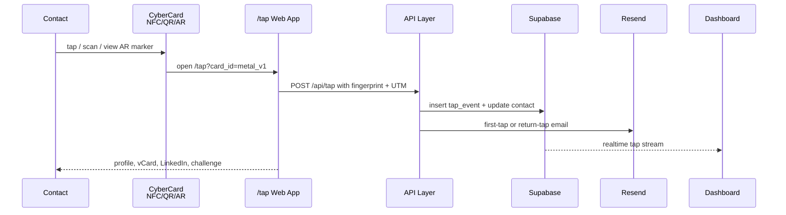
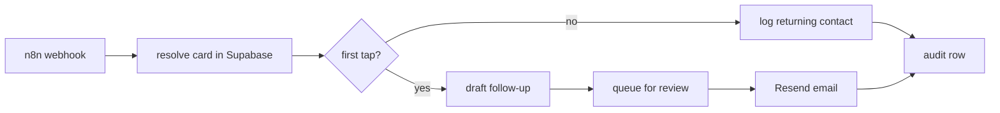

# CyberCard / CyberFlipper

**Personfu advanced NFC/RF identity card, ESP32-S3 wallet device, and Flipper Zero companion lab.**

CyberCard is a premium metal business card that behaves like an identity system, not just a tag. It combines NFC, QR, AR, vCard, LinkedIn, one-time email automation, Supabase analytics, and controlled lab instrumentation. CyberFlipper is the capability layer around Flipper Zero and the Flipper Wi-Fi dev board. CyberCard Device is the active ESP32-S3/CC1101/NFC prototype that proves the same workflows can be carried in a wallet form factor.

> Authorized use only. This project is for owned hardware, lab environments, consent-based demos, security education, and defensive validation. It does not include instructions for unauthorized exploitation, credential theft, stealth, persistence, or evasion.


## What This Builds

| Layer | Build | Purpose | Trust Boundary |
|---|---|---|---|
| Product | Premium metal NFC/QR/AR card | Contact exchange, vCard, LinkedIn, one-time email automation | Network/API layer |
| Capability | Flipper Zero + Wi-Fi dev board | Authorized RF/NFC/IR/iButton/BLE/Wi-Fi learning and demos | Human authorization + lab scope |
| Tool builder | ESP32-S3 + CC1101 + PN5180 + NTAG216 | Wallet device prototype, telemetry, controlled scanning, safe automation | Signed firmware + backend audit |
| Backend | Next.js + Supabase + Resend + Stripe | Tap ingestion, audit, contacts, dashboard, billing | RLS + service role isolation |
| SOC/Telemetry | Audit tables + dashboard + n8n | First-tap signal, conversion funnel, device health, detections | Append-only event model |

## Repository Map

```text
CYBERCARD/
  app/
    api/tap/route.ts            Tap intake, fingerprinting, geo, email trigger
    api/vcard/route.ts          vCard delivery
    api/challenge/route.ts      DEFCON challenge verification
    api/gov/route.ts            JWT restricted-access gate
    api/stripe/route.ts         Stripe subscription lifecycle
    dashboard/cards/page.tsx    CFO/tap stream dashboard
    challenge/[hash]/page.tsx   Public puzzle page
  ar/index.html                 A-Frame AR marker identity scene
  docs/                         Engineering, RF, SOC, install, threat docs
  emails/templates.tsx          Resend email templates
  firmware/cybercard_v0.ino     ESP32-S3 + NFC + CC1101 prototype firmware
  flipper/                      Safe Flipper Zero example files
  modules/                      System-model modules for display/input/IMU/network/identity
  n8n/                          Tap-to-revenue workflow
  payloads/scannables/          Harmless QR/NFC/contact automation samples
  scripts/                      NDEF generator + Proxmark mirror
  supabase/                     Database migrations
```

## System Architecture

```mermaid
flowchart TD
  Card[Premium Metal CyberCard\nNTAG216 + QR + AR marker] --> Trigger[NFC / QR / AR Trigger]
  Trigger --> Tap[/tap?card_id=metal_v1]
  Tap --> Api[Next.js API Layer]
  Api --> DB[(Supabase Postgres\nRLS + audit_events)]
  Api --> Email[Resend\nfirst tap + returning tap]
  Api --> VCard[vCard + LinkedIn]
  Api --> Challenge[DEFCON Challenge\nreward JWT]
  DB --> Dashboard[Dashboard\nMRR + tap stream + contacts]

  Flipper[Flipper Zero + Wi-Fi Dev Board] --> Lab[Authorized RF/NFC/IR/iButton/Wi-Fi Lab]
  ESP[CyberCard Device\nESP32-S3 + CC1101 + PN5180] --> Lab
  Lab --> Telemetry[Consent Lab Telemetry]
  Telemetry --> DB
```

## Physical Product: CyberCard


| Item | Specification |
|---|---|
| Card form factor | ISO/IEC 7810 ID-1: 85.60 mm x 53.98 mm |
| Material | 316L stainless steel or black PVD metal card blank |
| NFC | NTAG216, ISO/IEC 14443 Type A, NFC Forum Type 2 Tag, 888 bytes user memory |
| QR | `/tap?card_id=<id>&utm_source=qr&utm_medium=card` |
| AR | Marker image opens AR scene, then routes to `/tap?card_id=ar_v1` |
| Back challenge | Consent-based hash puzzle that leads to `/challenge/<hash>` |
| Trust model | Tag is public. Backend handshake is authoritative. |

### Trigger URLs

| Card ID | Trigger | URL Pattern | Outcome |
|---|---|---|---|
| `metal_v1` | NFC/QR | `/tap?card_id=metal_v1` | LinkedIn, vCard, first-tap email |
| `ar_v1` | AR marker | `/tap?card_id=ar_v1&utm_source=ar` | AR profile handoff |
| `demo_v1` | Conference demo | `/tap?card_id=demo_v1` | Email every tap for demo funnel |
| `scan_v1` | QR hard redirect | `/tap?card_id=scan_v1` | Controlled redirect event |
| `file_v1` | Signed file | `/tap?card_id=file_v1` | one-time document delivery |
| `gov_v1` | restricted | `/tap?card_id=gov_v1` | JWT challenge gate |

## Active Hardware: CyberCard Device v0

The prototype uses off-the-shelf modules first. Miniaturization comes after proof.

| Subsystem | Part | Function | Interface |
|---|---|---|---|
| MCU | ESP32-S3 | 240 MHz dual-core, Wi-Fi, BLE, USB OTG | USB-C, SPI, I2C, GPIO |
| NFC controller | PN5180 | ISO14443A/B, ISO15693, FeliCa reader/writer | SPI |
| NFC tag | NTAG216 sticker/card inlay | Public NDEF identity URL | 13.56 MHz |
| Sub-GHz | CC1101 | 300-928 MHz lab receiver/transceiver | SPI + GDO IRQ |
| Display | SSD1306 OLED | Mode, RSSI, battery, tag status | I2C |
| Storage | SPIFFS, optional microSD | ring buffer and telemetry cache | flash / SPI |
| Power | 500 mAh LiPo + charger | mobile lab runtime | USB-C charge |
| Expansion | IR LED/receiver, iButton probe | line-of-sight and 1-Wire demo paths | GPIO |

### GPIO Map

| ESP32-S3 Pin | Function | Notes |
|---|---|---|
| GPIO 1 | I2C SDA | OLED + NFC support bus |
| GPIO 2 | I2C SCL | OLED + NFC support bus |
| GPIO 4 | CC1101 GDO0 | packet/RSSI interrupt |
| GPIO 5 | CC1101 GDO2 | status line |
| GPIO 6 | Button | short press mode cycle, long press reset |
| GPIO 7 | WS2812 | status RGB |
| GPIO 10 | CC1101 CS | SPI select |
| GPIO 11 | SPI MOSI | shared SPI |
| GPIO 12 | SPI SCK | shared SPI |
| GPIO 13 | SPI MISO | shared SPI |
| GPIO 14 | PN5180 BUSY | NFC ready |
| GPIO 15 | PN5180 IRQ | NFC interrupt |
| GPIO 16 | PN5180 RESET | NFC reset |
| GPIO 17 | PN5180 CS | SPI select |
| GPIO 18 | Battery ADC | 1:2 divider |
| GPIO 21 | Optional IR TX | current-limited IR LED driver |
| GPIO 33 | Optional iButton | 1-Wire read-only probe |
| GPIO 34 | Optional microSD CS | SPI SD card select |

## Flipper Zero + Wi-Fi Dev Board Layer

CyberFlipper does not replace Flipper Zero. It augments it and documents safe, repeatable lab workflows.

| Flipper Capability | CyberCard Equivalent | Safe Demo Use |
|---|---|---|
| NFC read/write | NTAG216 NDEF generator | write your own `/tap` URL |
| RFID LF | Proxmark threat primer | compare legacy risks, no badge cloning instructions |
| Sub-GHz | CC1101 spectrum telemetry | receive-first lab observation and compliance notes |
| IR | optional IR transmitter | local presentation/media demo only |
| iButton | optional 1-Wire probe | read-only legacy protocol education |
| BadUSB | harmless contact automation | open profile URL, type consent banner, launch vCard |
| Wi-Fi dev board | ESP32-S2/S3 Wi-Fi lab | captive-portal awareness demo on your own AP |

### Wi-Fi Board Integration Model

```mermaid
flowchart LR
  FZ[Flipper Zero] --> GPIO[GPIO Header]
  GPIO --> WDB[Wi-Fi Dev Board\nESP32-S2/S3]
  WDB --> AP[Owned Lab AP\nCyberCard-Setup]
  WDB --> Portal[Consent Portal\nprofile + vCard + telemetry notice]
  Portal --> TapAPI[/api/tap]
  TapAPI --> Audit[(Supabase audit_events)]
```

The Wi-Fi board path is for owned-network demos: show why rogue SSIDs and captive portals are risky by building a transparent, consent-first portal that states what it collects and routes users to the normal `/tap` workflow. No credential capture. No deceptive login clones.

## Safe Payload and Scannable Model

The project includes harmless examples in [flipper/](flipper) and [payloads/scannables/](payloads/scannables). They are designed to be fun at DEFCON without crossing into abuse.

| Payload Type | File | Behavior |
|---|---|---|
| BadUSB safe demo | `flipper/badusb/cybercard_contact_demo.txt` | Opens a browser to your CyberCard tap URL and types a consent notice |
| NFC card sample | `flipper/nfc/cybercard_metal_v1.nfc` | Stores a URL record for `metal_v1` |
| IR demo | `flipper/infrared/cybercard_presentation_remote.ir` | Placeholder for owned presentation clicker workflow |
| QR matrix | `payloads/scannables/SCANNABLES.md` | QR/NFC/AR URL patterns and event mapping |
| vCard automation | `payloads/scannables/preston_furulie.vcf` | Contact card sample |

## RF and Physics Reference


Core equations used throughout the hardware docs:

| Quantity | Equation | Notes |
|---|---|---|
| Wavelength | `lambda = c / f` | `c = 299,792,458 m/s` |
| Near-field boundary | `r < lambda / (2*pi)` | rough reactive near-field threshold |
| Free-space path loss | `FSPL(dB)=20log10(d)+20log10(f)+32.44` | `d` in km, `f` in MHz |
| Quarter-wave antenna | `L = c / (4f * velocity_factor)` | practical antennas use loaded/shortened elements |
| NFC LC resonance | `f0 = 1 / (2*pi*sqrt(L*C))` | tune loop to 13.56 MHz |
| Battery runtime | `hours = capacity_mAh / load_mA * efficiency` | use 0.75-0.9 efficiency estimate |

### Frequency Matrix

| Domain | Frequency | Wavelength | Interface | CyberCard Use |
|---|---:|---:|---|---|
| LF RFID | 125 kHz | ~2398 m | magnetic near field | research primer, not product trust |
| NFC | 13.56 MHz | ~22.1 m | magnetic near field | NTAG216, PN5180 |
| VHF | 136-174 MHz | ~2.2-1.7 m | far-field RF | Quansheng UV-K5 receive-first appendix |
| UHF | 400-520 MHz | ~0.75-0.58 m | far-field RF | UV-K5 receive-first appendix |
| Sub-GHz ISM | 315/433/868/915 MHz | ~0.95/0.69/0.35/0.33 m | far-field RF | CC1101 authorized lab |
| Wi-Fi/BLE | 2.4 GHz | ~12.5 cm | far-field RF | provisioning, BLE beacon, Wi-Fi board |
| IR | ~300-430 THz optical | ~700-950 nm | line of sight | local demo remote control |
| USB-C | wired | n/a | differential pair | serial, HID-safe demo, power |

## Telemetry Matrix

| Event | Source | Fields | Storage | Detection/Use |
|---|---|---|---|---|
| tap event | NFC/QR/AR/Wi-Fi portal | card_id, source, medium, fingerprint hash, coarse geo | `tap_events` | first contact, repeat visitor |
| challenge attempt | DEFCON page | challenge hash, answer hash result, fingerprint hash | `challenge_attempts` | engagement depth, first solver |
| risk event | `/risk` consent page | safe snapshot, indicators, actor hash | `risk_events` | awareness and detection training |
| restricted access | gov gate | JWT jti, actor hash, country, status | `audit_events` | auth forensics |
| device health | ESP32 | battery, firmware, mode, RSSI bucket, error code | planned `device_telemetry` | fleet health |
| Stripe event | webhook | customer, plan, subscription state | `orgs` + audit | billing automation |
| n8n workflow | webhook | branch, draft status, resend status | audit row | outreach queue |

## Installation Tutorial

### 1. Database

```bash
supabase db push
# Apply CYBERCARD/supabase/001_cybercard_init.sql
# Apply CYBERCARD/supabase/002_audit_and_tenancy.sql
# Apply CYBERCARD/supabase/003_break_glass_and_device_telemetry.sql
# Apply CYBERCARD/supabase/004_risk_awareness_events.sql
```

### 2. Web App Environment

```text
NEXT_PUBLIC_SUPABASE_URL=https://xxxx.supabase.co
NEXT_PUBLIC_SUPABASE_ANON_KEY=<anon>
SUPABASE_SERVICE_ROLE_KEY=<service-role>
RESEND_API_KEY=re_xxx
GOV_JWT_SECRET=<256-bit-secret>
STRIPE_SECRET_KEY=sk_live_xxx
STRIPE_WEBHOOK_SECRET=whsec_xxx
```

### 3. NFC Payload

```bash
node CYBERCARD/scripts/generate_ndef.js --url "https://fllc.net/tap?card_id=metal_v1&utm_source=nfc&utm_medium=card" --card-id metal_v1
```

### 4. Proxmark Research Archive

Do not commit the PDFs. Mirror them locally:

```bash
pip install requests beautifulsoup4 tqdm
python CYBERCARD/scripts/proxmark_scraper.py --out ~/Downloads/proxmark_docs --workers 2 --max-retries 3
```

### 5. ESP32-S3 Firmware

1. Install Arduino ESP32 core.
2. Install Adafruit GFX, SSD1306, NeoPixel, BLE dependencies.
3. Open [firmware/cybercard_v0.ino](firmware/cybercard_v0.ino).
4. Set `TAP_URL` to your live `/tap` URL.
5. Flash ESP32-S3 dev board.
6. Use button mode cycle: status -> NFC write -> NFC scan -> RF scan -> RF TX test.

RF TX test is for shielded bench validation or legal lab conditions only.

### 6. Safe Risk Awareness Page

Deploy `/risk` at `https://fllc.net/risk` as a consent-based training page. It previews a limited browser snapshot, records only after explicit consent, and refuses drive-by downloads, exploit execution, credential collection, clipboard access, file access, and hidden script behavior.

## Documentation Index

| Doc | Purpose |
|---|---|
| [docs/ARCHITECTURE.md](docs/ARCHITECTURE.md) | full layer model, data flow, diagrams |
| [docs/HARDWARE_BLUEPRINT.md](docs/HARDWARE_BLUEPRINT.md) | mechanical/electrical blueprint and dimensions |
| [docs/RF_SPECTRUM_MATRIX.md](docs/RF_SPECTRUM_MATRIX.md) | RF math, bands, wavelengths, compliance notes |
| [docs/FIRMWARE_PROTOCOLS.md](docs/FIRMWARE_PROTOCOLS.md) | firmware modes, USB/BLE/GPIO/protocol contracts |
| [docs/FLIPPER_WIFI_BOARD.md](docs/FLIPPER_WIFI_BOARD.md) | Flipper Wi-Fi dev board integration |
| [docs/TELEMETRY_SOC.md](docs/TELEMETRY_SOC.md) | audit, SOC, SIEM, analytics model |
| [docs/INSTALLATION.md](docs/INSTALLATION.md) | software, hardware, NFC, Flipper setup |
| [docs/RED_TEAM_ENGINEERING_CARD.md](docs/RED_TEAM_ENGINEERING_CARD.md) | chapter redesign, system model, physics/control loops |
| [docs/RISK_AWARENESS_PAGE.md](docs/RISK_AWARENESS_PAGE.md) | safe fllc.net/risk alternative to grabber links |
| [docs/BREAK_GLASS_ADMIN.md](docs/BREAK_GLASS_ADMIN.md) | visible admin controls that replace backdoors |
| [docs/AUTHORIZED_USE_POLICY.md](docs/AUTHORIZED_USE_POLICY.md) | legal/safety scope |
| [modules/display_engine/README.md](modules/display_engine/README.md) | LED/OLED visualization engine model |
| [modules/identity_layer/README.md](modules/identity_layer/README.md) | QR/NFC/Wi-Fi identity abstraction |
| [docs/PROXMARK_THREAT_PRIMER.md](docs/PROXMARK_THREAT_PRIMER.md) | defensive reading guide for proxmark archive |
| [docs/QUANSHENG_UVK5_BRIDGE.md](docs/QUANSHENG_UVK5_BRIDGE.md) | VHF/UHF receive-first appendix |
| [docs/HARDENING_CHECKLIST.md](docs/HARDENING_CHECKLIST.md) | production security checklist |
| [docs/DEFCON_CARD.md](docs/DEFCON_CARD.md) | DEFCON card and challenge design |
| [docs/THREAT_MODEL.md](docs/THREAT_MODEL.md) | formal threat model |
| [docs/HARDWARE_BOM.md](docs/HARDWARE_BOM.md) | bill of materials and pinout |

## Design Principle

The clever part is not the tag. It is the system around the tag:

```text
Public trigger -> explicit tap endpoint -> fingerprint hash -> audit row -> consent-aware automation -> measurable follow-up
```

That means cloning the NFC URL is not a compromise. It is just another observable event. The system wins because every interaction is measurable, explainable, and bounded by authorization.

Use:

```text
lambda = c / f
c = 299,792,458 m/s
near-field boundary r ~= lambda / (2*pi)
quarter-wave antenna L ~= lambda / 4
```

| Domain | Frequency | Wavelength | Interface | CyberCard use |
|---|---:|---:|---|---|
| LF RFID | 125 kHz | 2398.34 m | magnetic near-field | training reference only |
| iButton / 1-Wire | wired | n/a | single-wire bus | optional read-only legacy demo |
| NFC | 13.56 MHz | 22.11 m | magnetic near-field | NTAG216 tap + NDEF URL |
| VHF receive | 136-174 MHz | 2.20-1.72 m | RF far-field | UV-K5 receive-first research |
| UHF receive | 400-520 MHz | 0.75-0.58 m | RF far-field | UV-K5 receive-first research |
| Sub-GHz ISM | 315/433/868/915 MHz | 0.95/0.69/0.35/0.33 m | RF far-field | CC1101 lab scan, telemetry, compliance tests |
| Wi-Fi/BLE | 2.4 GHz | 0.125 m | RF far-field | provisioning, beacon, dashboard sync |
| IR | 850-950 nm | optical | line of sight | harmless remote-control lab examples |
| USB-C | wired | n/a | differential pair | serial debug, safe HID contact demo |

### RF Design Notes

| Subsystem | Engineering target | Practical note |
|---|---|---|
| NFC loop | tune around 13.56 MHz, Q controlled | metal cards detune antennas; use ferrite layer or external inlay |
| CC1101 | 50 ohm feed, band-specific antenna | do not use one antenna for all bands without accepting loss |
| Wi-Fi/BLE | keep antenna clear of ground and metal | ESP32-S3-WROOM-1U with U.FL is preferred for metal enclosures |
| IR | 940 nm LED, transistor driver | line-of-sight only; no network trust implied |
| iButton | ESD protection, pull-up sizing | read-only default in docs and firmware roadmap |
| USB-C | ESD, CC resistors, shield grounding | production units need USB compliance testing |
| microSD | SPI bus, level/power budget | optional offline cache; encrypt sensitive logs before storage |

## Product Flow



## Trigger Matrix

| Trigger | Example URL or artifact | UTM source | Backend action | Output |
|---|---|---|---|---|
| NFC tap | `/tap?card_id=metal_v1` | `nfc` | POST `/api/tap` | profile + vCard |
| QR scan | `/tap?card_id=scan_v1&utm_source=qr` | `qr` | POST `/api/tap` | profile or redirect |
| AR marker | `ar/index.html` -> `/tap?card_id=ar_v1` | `ar` | POST `/api/tap` | AR identity scene |
| DEFCON puzzle | `/challenge/<hash>` | `challenge` | POST `/api/challenge` | reward JWT |
| Risk awareness | `/risk` | `risk` | POST `/api/risk` after consent | safe telemetry lesson |
| File download | `/tap?card_id=file_v1` | `file` | asset lookup | one-time asset |
| Gov gate | `/tap?card_id=gov_v1` | `gov` | `/api/gov` JWT handshake | restricted view |
| BLE beacon | `CyberCard-FLLC` | `ble` | future telemetry | nearby discovery |
| Flipper NFC demo | `.nfc` safe URL card | `flipper` | same tap route | reproducible demo |
| BadUSB safe demo | opens local/contact URL only | `usb_demo` | same tap route | harmless contact automation |

## CyberFlipper and Flipper Wi-Fi Dev Board

CyberFlipper is the capability layer around hardware you already own: Flipper Zero, Wi-Fi dev board, IR, iButton, RFID/NFC, and Sub-GHz. CyberCard does not duplicate Flipper Zero. It makes the demonstrations measurable, branded, and business-card-replicable.

```mermaid
flowchart TD
  FZ[Flipper Zero] --> NFC[NFC/RFID demos]
  FZ --> SG[Sub-GHz receive/lab files]
  FZ --> IR[IR line-of-sight demos]
  FZ --> IB[iButton/1-Wire demos]
  WIFI[Wi-Fi Dev Board<br/>ESP32-based] --> PORTAL[Consent captive portal demo]
  WIFI --> SCAN[Owned-network Wi-Fi assessment notes]
  CARD[CyberCard] --> TAP[/tap identity funnel]
  CARD --> QR[QR/NFC/AR scannables]
  TAP --> SOC[Supabase audit + dashboard]
  NFC --> TAP
  IR --> TAP
  IB --> TAP
  PORTAL --> TAP
```

### Wi-Fi Board Capability Model

| Capability | Safe CyberCard use | Not included |
|---|---|---|
| Captive portal | consent landing page for your own event table or lab network | credential harvesting |
| Probe awareness | educational explanation of client privacy risk | passive tracking of third parties |
| AP provisioning | configure ESP32 CyberCard device | evil twin deployment |
| Packet observation | owned lab network diagnostics | unauthorized interception |
| Web demo | redirect to `/tap?card_id=demo_v1` | phishing |

## Safe Payload Philosophy

This repo includes harmless payloads and extension files that show the idea without crossing into abuse.

| Payload class | Included example | Safety boundary |
|---|---|---|
| NFC | `.nfc` URL record to `/tap` | public URL only, no credential material |
| QR | contact and challenge URLs | no auto-download executables |
| BadUSB | open profile URL, type consent banner | no persistence, no shell execution beyond opening a browser |
| IR | presentation/media remote template | no disruptive blasting or unknown-device targeting |
| Sub-GHz | documentation and receive-first lab notes | no rolling-code capture/replay instructions |
| Wi-Fi | consent captive portal text | no credential collection |
| OSINT | self-profile enrichment checklist | no doxxing or non-consensual collection |

## Telemetry Matrix

| Event | Source | Fields | Detection value | Privacy stance |
|---|---|---|---|---|
| tap_event | NFC/QR/AR/Flipper demo | `card_id`, `fingerprint_hash`, geo country/city, UTM | conversion, reach, repeat contacts | no raw IP stored |
| contact_update | API | tap count, cards seen, first/last seen | relationship warmth | pseudonymous hash |
| challenge_attempt | DEFCON puzzle | hash, answer hash result, fingerprint | technical engagement | consent implied by puzzle |
| gov_access | restricted flow | JWT JTI, actor hash, result | audit and access control | short TTL |
| device_telemetry | ESP32 future endpoint | battery, firmware, mode, RSSI summary | fleet health | no raw packet storage |
| stripe_event | Stripe webhook | customer/subscription IDs | billing lifecycle | Stripe handles PCI data |
| n8n_outreach | workflow | tap context + drafted follow-up | revenue automation | manual review recommended |

## Software Installation

### 1. Database

```bash
supabase db push
```

Migrations:

```text
CYBERCARD/supabase/001_cybercard_init.sql
CYBERCARD/supabase/002_audit_and_tenancy.sql
```

### 2. Environment

```text
NEXT_PUBLIC_SUPABASE_URL=https://xxxx.supabase.co
NEXT_PUBLIC_SUPABASE_ANON_KEY=<anon>
SUPABASE_SERVICE_ROLE_KEY=<service-role>
RESEND_API_KEY=re_xxx
GOV_JWT_SECRET=<256-bit-secret>
STRIPE_SECRET_KEY=sk_live_xxx
STRIPE_WEBHOOK_SECRET=whsec_xxx
```

### 3. NFC Payload

```bash
node CYBERCARD/scripts/generate_ndef.js --url "https://fllc.net/tap?card_id=metal_v1&utm_source=nfc&utm_medium=card" --card-id metal_v1
```

### 4. Proxmark Research Archive

The PDFs are not committed. Mirror the public archive locally:

```bash
pip install requests beautifulsoup4 tqdm
python CYBERCARD/scripts/proxmark_scraper.py --out ~/Downloads/proxmark_docs --workers 2 --max-retries 3
```

### 5. n8n Automation

Import:

```text
CYBERCARD/n8n/cybercard_tap_to_revenue.json
```

Flow:



## Firmware Build

Prototype firmware:

```text
CYBERCARD/firmware/cybercard_v0.ino
```

Modes:

| Mode | Button cycle | Purpose |
|---|---|---|
| Status | default | battery, BLE name, mode status |
| NFC write | short press | write `/tap` NDEF to NTAG216 in owned lab |
| NFC scan | short press | detect ISO14443A tags for learning |
| RF scan | short press | RSSI observation in lab |
| RF TX test | short press | short controlled carrier validation only |

Production hardening target:

```text
Secure Boot v2 + Flash Encryption + signed OTA + locked debug + encrypted telemetry cache
```

## Engineering Equations

### Link Budget

```text
P_rx(dBm) = P_tx + G_tx + G_rx - L_path - L_cable - L_misc
FSPL(dB) = 20 log10(d) + 20 log10(f) + 32.44
```

For `d` in kilometers and `f` in MHz.

### NFC Near Field

```text
r_near ~= lambda / (2*pi)
lambda_13.56MHz = 299,792,458 / 13,560,000 ~= 22.11 m
r_near ~= 3.52 m theoretical; practical NFC coupling is centimeters due to coil geometry and power limits.
```

### LC Resonance

```text
f0 = 1 / (2*pi*sqrt(L*C))
C = 1 / ((2*pi*f0)^2 * L)
```

If `L = 1.5 uH` and `f0 = 13.56 MHz`, `C ~= 91.9 pF` before parasitics and tuning.

### Battery Runtime

```text
runtime_hours = capacity_mAh * derating / load_mA
```

| Mode | Approx load | 500 mAh LiPo @ 80% derate |
|---|---:|---:|
| Deep sleep beacon off | 1 mA | 400 h |
| BLE beacon | 15 mA | 26.7 h |
| OLED + idle | 35 mA | 11.4 h |
| Wi-Fi active | 120 mA | 3.3 h |
| NFC active | 90 mA | 4.4 h |
| Sub-GHz scan | 65 mA | 6.2 h |

## Documentation Index

| Document | Purpose |
|---|---|
| [docs/AUTHORIZED_USE_POLICY.md](docs/AUTHORIZED_USE_POLICY.md) | legal/safety boundary |
| [docs/ARCHITECTURE.md](docs/ARCHITECTURE.md) | full system model |
| [docs/HARDWARE_BLUEPRINT.md](docs/HARDWARE_BLUEPRINT.md) | board, pinout, dimensions, BOM expansion |
| [docs/RF_SPECTRUM_MATRIX.md](docs/RF_SPECTRUM_MATRIX.md) | RF/optical/wired protocol map |
| [docs/FIRMWARE_PROTOCOLS.md](docs/FIRMWARE_PROTOCOLS.md) | BLE, USB, GPIO, OTA, mode state machine |
| [docs/TELEMETRY_SOC.md](docs/TELEMETRY_SOC.md) | analytics, audit, SOC detection |
| [docs/INSTALLATION.md](docs/INSTALLATION.md) | deployment tutorial |
| [docs/FLIPPER_WIFI_BOARD.md](docs/FLIPPER_WIFI_BOARD.md) | Flipper + Wi-Fi board safe workflows |
| [docs/PROXMARK_THREAT_PRIMER.md](docs/PROXMARK_THREAT_PRIMER.md) | research-to-defense reading guide |
| [docs/QUANSHENG_UVK5_BRIDGE.md](docs/QUANSHENG_UVK5_BRIDGE.md) | VHF/UHF receive-first extension |
| [docs/HARDENING_CHECKLIST.md](docs/HARDENING_CHECKLIST.md) | production security checklist |
| [docs/DEFCON_CARD.md](docs/DEFCON_CARD.md) | challenge and conference card spec |
| [docs/HARDWARE_BOM.md](docs/HARDWARE_BOM.md) | original BOM |
| [docs/THREAT_MODEL.md](docs/THREAT_MODEL.md) | threat model |

## Build Philosophy

CyberCard should feel like a serious artifact: something a recruiter, founder, red teamer, or DEFCON hallway contact can tap once and immediately understand that the builder thinks in systems.

The flex is not a noisy payload. The flex is a full-stack physical identity system with math, RF discipline, telemetry, backend security, and consent-aware automation stitched into a business card.
