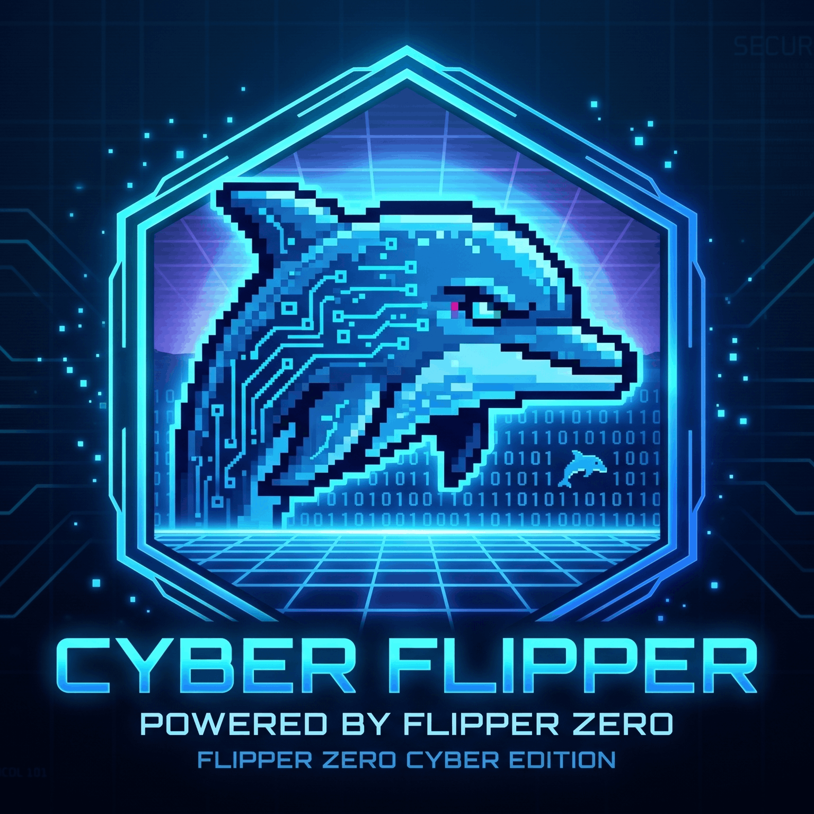
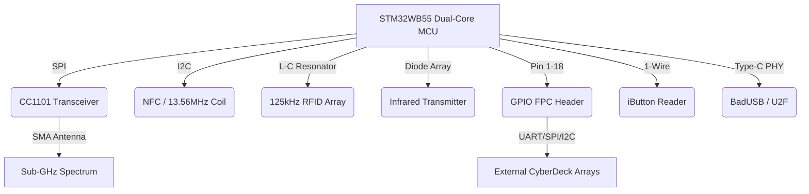

# CyberFlipper / CyberCard

**Personfu @ FurulieLLC — unified Flipper Zero custom firmware kit + CyberCard identity-and-RF wallet system.**

This single repository contains two cohesive product lines that share one safety doctrine, one telemetry surface (`fllc.net`), and one threat model:

1. **CyberFlipper** — Flipper Zero F-series custom SD card distribution: BadUSB CVE awareness payloads, NFC, Sub-GHz, 125 kHz RFID, IR, U2F, dolphin assets, Wi-Fi dev board portal demos, Lab401 catalog integration, and the full HTML/JS dashboard at `personfu.github.io/CyberFlipper/`.
2. **CyberCard** — premium metal NFC/QR/AR business card + ESP32-S3 wallet device + Next.js web/API stack (`/tap`, `/risk`, `/challenge`, `/dashboard`, Supabase + Resend + Stripe). Lives under [CYBERCARD/](CYBERCARD/).

Both halves implement the same Personfu authorization gate: consent-first scannables, audit-everything, no credential-capture portals, no CVE droppers, no auto-execute payloads. Authorized blue-team / DEFCON / lab use only.

---

## Repo Map

```text
CyberFlipper/
├── README.md                     ← this unified doc
├── CYBERFLIPPER_Logo.png
├── CYBERFLIPPER-v1.2.1-SD_CARD.zip      Flipper SD card distribution (release artifact)
├── CYBERFLIPPER-v1.2.1-UPDATE.zip       Flipper update bundle
├── CYBERFLIPPER-v1.2.1-SD_CARD/         expanded SD card tree
├── SD_CARD_READY/                       ready-to-copy SD card payload set
├── badusb/                              CVE-awareness BadUSB payloads (auto-generated)
├── nfc/                                 NFC card dumps + research
├── subghz/                              Sub-GHz signal captures + research notes
├── lfrfid/                              125 kHz RFID dumps
├── infrared/                            IR remote universal databases
├── u2f/                                 U2F key assets
├── dolphin/                             Dolphin animation pack
├── apps/                                .fap apps (Wi-Fi/RF/BLE/SubGHz/Games/GPIO/NFC)
├── firmware/                            firmware source mirrors
├── dist/                                build outputs
├── docs/                                project docs (LEGAL, install, hardware)
├── images/, assets/                     web/dashboard assets
├── web/                                 GitHub Pages dashboard
├── third_party/                         vendor sources
├── legacy/                              legacy artifacts
├── scripts/                             build/release scripts
├── manifest.json, manifest.txt          release manifests
├── update.fuf, update.txt, updater.bin  Flipper update files
├── radio.bin, splash.bin, firmware.dfu  Flipper binaries
├── resources.tar (.bak)                 Flipper resources tarball
├── inspect_tar.py, test_tar.py          tar diagnostics
├── .github/, .gitea/                    CI workflows (daily CVE BadUSB, pages, release)
└── CYBERCARD/                           CyberCard identity system + ESP32-S3 wallet device + Next.js app
    ├── package.json, tsconfig.json, next.config.mjs, tailwind.config.ts, .env.example
    ├── app/                             Next.js routes (tap, risk, challenge, dashboard, api/*)
    ├── lib/supabase/server.ts
    ├── docs/                            19+ deep-dive docs
    │   ├── HARDWARE_BLUEPRINT.md, HARDWARE_BOM.md
    │   ├── RF_SPECTRUM_MATRIX.md, FIRMWARE_PROTOCOLS.md
    │   ├── FLIPPER_WIFI_BOARD.md        ← cross-surface payload methodology
    │   ├── FLLC_SITE_CONTENT.md         ← public website spec
    │   ├── QUANSHENG_UVK5_BRIDGE.md
    │   ├── PROXMARK_THREAT_PRIMER.md
    │   ├── TELEMETRY_SOC.md, THREAT_MODEL.md
    │   ├── BREAK_GLASS_ADMIN.md, HARDENING_CHECKLIST.md
    │   ├── AUTHORIZED_USE_POLICY.md, RISK_AWARENESS_PAGE.md
    │   ├── DEFCON_CARD.md, RED_TEAM_ENGINEERING_CARD.md
    │   ├── ARCHITECTURE.md, INSTALLATION.md
    │   └── assets/
    ├── firmware/cybercard_v0.ino        ESP32-S3 + PN5180 + CC1101 prototype
    ├── flipper/                         safe Flipper integration files
    │   ├── badusb/                      consent-only HID demos (open profile, type disclosure)
    │   ├── nfc/                         URL-only NDEF demos
    │   └── infrared/                    owned-remote demos
    ├── payloads/scannables/SCANNABLES.md
    ├── ar/index.html                    A-Frame AR identity scene
    ├── emails/templates.tsx             Resend / React Email
    ├── n8n/                             tap-to-revenue workflow
    ├── modules/                         display/input/IMU/network/identity modules
    ├── scripts/                         NDEF generator + Proxmark mirror tool
    └── supabase/                        DB migrations + RLS
```

## Two Halves, One System

| Concern | CyberFlipper (root) | CyberCard ([CYBERCARD/](CYBERCARD/)) |
|---|---|---|
| Form factor | Flipper Zero + Wi-Fi dev board | Metal business card + ESP32-S3 wallet device |
| Distribution | qFlipper SD card copy | NFC tap / QR / AR / Wi-Fi portal |
| RF surface | CC1101, ST25R3916, 125 kHz, BLE 5.4 | PN5180, NTAG216, CC1101 module, Wi-Fi/BLE |
| Backend | static GitHub Pages dashboard | Next.js app on fllc.net + Supabase + Stripe + Resend |
| Audit | local SD card events, manual review | realtime `tap_events` + `device_telemetry` + dashboard |
| Public URL | `personfu.github.io/CyberFlipper/` | `fllc.net/tap` and `fllc.net/risk` |
| Safety boundary | CISA KEV-derived BadUSB payloads for awareness, no live exploitation | consent-first scannables, no credential capture, no auto-execute |

The CyberCard `/tap` flow is replicable from any CyberFlipper surface: a Flipper NFC card, a Wi-Fi captive portal, a printed QR, or a HID demo can all land on the same `https://fllc.net/tap?card_id=...&utm_source=...` URL and produce the same audit row.

## Fast Start

### CyberFlipper SD card distribution
1. Download `CYBERFLIPPER-v1.2.1-SD_CARD.zip` from the [Releases page](https://github.com/Personfu/CyberFlipper/releases).
2. Extract — you will see `badusb/`, `infrared/`, `nfc/`, `subghz/`, `lfrfid/`, `dolphin/`, `apps/`, `u2f/`.
3. Open qFlipper → connect Flipper via USB → SD Card tab.
4. Drag the extracted folders onto the SD card root.
5. Eject and reboot.

No firmware flashing is required or supported. SD card content copy only.

### CyberCard web/API app
```bash
cd CYBERCARD
cp .env.example .env.local
npm install
npm run dev
```
Then visit `http://localhost:3000/tap?card_id=demo_v1&utm_source=local&utm_medium=dev` to exercise the tap flow. See [CYBERCARD/README.md](CYBERCARD/README.md) for the full hardware engineering, RF math, and deployment guide.

## Authorized Use

This repository is for owned hardware, lab environments, consent-based demos, security education, and defensive validation. It does not include instructions for unauthorized exploitation, credential theft, stealth, persistence, or evasion. Sub-GHz transmissions and Wi-Fi captive portals must be operated only on owned hardware, owned spectrum, and owned networks; ham bands require a licensed operator. See [CYBERCARD/docs/AUTHORIZED_USE_POLICY.md](CYBERCARD/docs/AUTHORIZED_USE_POLICY.md).

---


<p align="center">
  
</p>

<p align="center">
  <strong>[ CYBERFLIPPER: PRODUCTION RELEASE v1.1.0 ]</strong><br>
  <em>Maintained by Personfu @ <a href="https://fllc.net">fllc.net</a> </em><br>
  <strong>Official Discord: <a href="https://discord.gg/Cd9qyvht7X">discord.gg/Cd9qyvht7X</a></strong>
</p>


<p align="center">
  <a href="https://docs.flipper.net/zero/development/hardware/schematic#"></a>
  <a href="https://docs.flipper.net/zero/development/hardware/schematic#"></a>
  <a href="https://docs.flipper.net/zero/development/hardware/schematic#"></a>
  <a href="https://docs.flipper.net/zero/development/hardware/schematic#"></a>
  <a href="https://github.com/Personfu/CyberFlipper" style="margin-left:8px;"></a>
</p>

---

## ΓûôΓûÆΓûæ I. HARDWARE SCHEMATIC ARCHITECTURE
**CYBERFLIPPER** operates natively on the official [MAIN_PCB_12.1.F7B9C6](CYBERFLIPPER_BUILD/CYBERFLIPPER/MAIN_PCB_12.1.F7B9C6_Assembly.pdf) framework. It exploits the dual-core **STM32WB55** microprocessor, pushing the limits of the embedded CC1101 transceiver and physical HID bus arrays to create an autonomous, pocket-operable signal intercept pipeline. 

*(For raw engineering blueprints, cross-reference the official [Flipper Development Hardware Schematic](https://docs.flipper.net/zero/development/hardware/schematic#)).*



---

## ΓûôΓûÆΓûæ II. PROTOCOL VECTORS & TELEMETRY MATRIX

| Vector | Internal Silicon Driver | Attack / Capture Simulation Capabilities |
| :--- | :--- | :--- |
| **Sub-GHz** | CC1101 Transceiver | Operates <1GHz. Overrides ASK/OOK/GFSK/MSK. Captures/Synthesizes rolling codes (Keeloq, Somfy). Includes deep-passive listening nodes. |
| **125 kHz RFID** | LF L-C Tuned Circuit | Emulates low-frequency proximity gates (HID Prox, EM4100, Indala). |
| **NFC (13.56 MHz)** | ST25R3916 Controller | Parses MIFARE Classic/Ultralight, NTAG architectures, ISO-14443A/B, and FeliCa transit layers. |
| **Infrared** | Vishay TSSP / Diodes | Harvests ambient carrier frequencies. Modded universal dictionaries control HVAC / AV topologies. |
| **GPIO & Modules** | 3.3V FPC Header | Raw interface for UART (Pin 13/14), SPI (Pin 2/3/4/5), and I2C arrays to host external modules. |
| **iButton** | 1-Wire Interface (Pin 17)| Physical emulation of Dallas Contact memory (DS1990A). Replicates magnetic constraint locks. |
| **Bad USB** | Type-C USB PHY | Enumerates as standard Human Interface Device (HID). Executes Tier-8 hyper-speed .txt injection vectors (RubberDucky). |
| **U2F** | STM32 Crypto Engine | Fully validated FIDO U2F hardware cryptography key for authenticating advanced reverse-shells. |
| **Video Game Mod** | ESP32 / RP2040 | Video-out framework repurposed for advanced Wi-Fi penetration staging or secondary external display mapping. |

---

## ΓûôΓûÆΓûæ III. EDC ECOSYSTEM & TITAN MODULARITY
CYBERFLIPPER serves as the core bridging microcontroller representing the "Swiss Army Knife of cybersecurity tools" for an extensive Everyday Carry (EDC) loadout. We integrate directly with the greatest external penetration hardware on the market:

*   **Wireless Exploitation:**
    *   📡 **[ESP32 Marauder (JustCallMeKoko)](https://github.com/justcallmekoko/ESP32Marauder):** Pinned over UART TX(13) / RX(14). Essential 802.11 deauth mapping, beacon spamming, and PMKID capture.
    *   ΓÜí **[Awake Dynamics ESP32-C5](https://awakedynamics.com/):** Next-generation 2.4/5GHz Wi-Fi overrides natively synthesized over the GPIO backbone.
*   **Rogue Signal & IMSI Detection:**
    *   🕵️‍♂️ **[Nyan Box](https://github.com/inAudible1/NyanBox):** Correlates Axon Camera network density to passively track law enforcement grids.
    *   📱 **[Ray Hunter](https://rayhunter.net/):** Verizon hotspot mod specifically dedicated to Stingray (Cell-Site Simulator) detection and IMSI catcher awareness.
*   **Captive Portals & Micro-Computing:**
    *   😈 **[M5Stick S3](https://docs.m5stack.com/en/core/m5stickc_plus2):** Running the "Evil" educational project for rapid captive-portal phishing emulation.
    *   🖥️ **[M5Stack Cardputer Advanced](https://shop.m5stack.com/products/m5stack-cardputer-esp32-s3-mini-keyboard-computer):** Running Porkchop firmware by Octo as a standalone serial analysis terminal.
*   **Spectrum Analysis & VHF/UHF Comms:**
    *   📻 **[HackRF Portapack H4](https://greatscottgadgets.com/hackrf/one/) & RTL-SDR:** Making the invisible world visible. When the Flipper's CC1101 bottlenecks, escalate to external 1MHz-6GHz SDR arrays via physical SPI bridging.
    *   🎙️ **[Quansheng UV-K5](https://github.com/egzumer/uv-k5-firmware-custom):** A highly capable, hackable handheld radio. The Flipper's GPIO serves as a programmable PTT interface to transmit encrypted digital APRS payloads.
*   **📡 [ProjectZero](https://github.com/C5Lab/projectZero) & OWASP Intelligence:** Integrated security logic and protocol manipulation derived from official Project Zero vulnerability mapping and the [OWASP CheatSheet Series](https://github.com/OWASP/CheatSheetSeries).
*   **🦆 Hak5 Tactical Payloads:** Native translation of master payload repositories: [USB Rubber Ducky](https://github.com/hak5/usbrubberducky-payloads), [WiFi Pineapple](https://github.com/hak5/wifipineapplepager-payloads), [Bash Bunny](https://github.com/hak5/bashbunny-payloads), and [OMG Cable](https://github.com/hak5/omg-payloads).
*   **🛠️ Cyber-Analytic Arrays:** Logic and conversion matrices sourced from [CyberChef (GCHQ)](https://github.com/gchq/CyberChef), [SecLists](https://github.com/Personfu/seclists), and [Awesome-Hacking](https://github.com/Hack-with-Github/Awesome-Hacking).
*   **🌍 Signal ISR (Intelligence, Surveillance, Reconnaissance):** Direct integration of cellular tower and satellite tracking logic via [Tower-Hunter](https://github.com/Ringmast4r/Tower-Hunter) and [GNSS](https://github.com/Ringmast4r/GNSS) frameworks.

> *We operate closely mapped alongside heavily customized smartphones and physical tools: **Nothing Phone 3** (Brute-force cloud processing), **Civivi Elementum Button Lock** (Physical override architecture), and the **Zebra F-701** (Tactical scribing).*

---

## ΓûôΓûÆΓûæ IV. INSTALLATION ΓÇö SD CARD VIA qFlipper

> **The only supported install method is SD card content copy via the qFlipper SD Card tab. No firmware flashing is required or supported.**

### CyberFlipper v1.2.1 ΓÇö Release 2026-04-20

**What's New**
- Daily CVE BadUSB payloads (auto-generated from CISA KEV catalog)
- Extra apps bundle updated
- SD card only distribution ΓÇö no OTA flash required

**Included BadUSB CVE Payloads:** See [badusb/](badusb/) for the full CVE payload listing.

> **LEGAL**: All payloads are for authorized security research in controlled environments only. See [LEGAL.md](docs/LEGAL.md).

### Steps

1. Download **`CYBERFLIPPER-v1.2.1-SD_CARD.zip`** from the [Releases page](https://github.com/Fu-LLC/CyberFlipper/releases).
2. Extract the zip ΓÇö you will see: `badusb/`, `infrared/`, `nfc/`, `subghz/`, `lfrfid/`, `dolphin/`, `apps/`, `u2f/`
3. Open **qFlipper** → connect Flipper via USB → click the **SD Card** tab.
4. Drag and drop the extracted folders onto the SD card root.
5. Eject and reboot your Flipper Zero.

### What's Included

| Folder | Contents |
| :--- | :--- |
| `badusb/` | 88+ BadUSB payloads + daily CVE scripts (Windows/Linux/macOS) |
| `infrared/` | IR universal remote databases |
| `nfc/` | NFC dumps, Amiibo collection, hotel keys |
| `subghz/` | Gate codes, vehicle signals, brute-force sets |
| `lfrfid/` | EM4100, HID Prox, Indala RFID dumps |
| `dolphin/` | Dolphin XP level data |
| `apps/` | 35+ WiFi/RF, 14 Bluetooth, 9 SubGHz, Games, GPIO, NFC tools (.fap) |
| `u2f/` | U2F key assets |

---

## ΓûôΓûÆΓûæ V. NATIVE SOFTWARE TOPOLOGY
*   **PASSIVE_NODE Integrations:** Background mapping software (wardriver.c). Natively formats 802.11 / NMEA frames to .csv for direct database sync without external parsing.
*   **qFlipper SD Card Protocol:** All content distributed as SD card data only. Copy via qFlipper SD Card tab ΓÇö no firmware flash, no OTA update required.

---

## ΓûôΓûÆΓûæ VI. HARDWARE TECHNICAL SPECIFICATIONS

> *Full specifications reference: [Official Flipper Zero Tech Specs](https://docs.flipper.net/zero/development/hardware/tech-specs) | [Hardware Schematics](https://docs.flipper.net/zero/development/hardware/schematic#)*

### 📐 Body

| Parameter | Value |
| :--- | :--- |
| **Materials** | PC, ABS, PMMA |
| **Height** | 40.1 mm (1.58 inches) |
| **Width** | 100.3 mm (3.95 inches) |
| **Depth** | 25.6 mm (1.01 inches) |
| **Weight** | 102 grams (3.6 ounces) |

### 🖥️ Display

| Parameter | Value |
| :--- | :--- |
| **Type** | Monochrome LCD |
| **Resolution** | 128×64 pixels |
| **Controller** | ST7567 |
| **Interface** | SPI |
| **Diagonal** | 1.4" |

### ⚙️ Microcontroller Unit (MCU)

| Parameter | Value |
| :--- | :--- |
| **Model** | STM32WB55RG |
| **Application Processor** | ARM Cortex-M4 32-bit @ 64 MHz |
| **Radio Processor** | ARM Cortex-M0+ 32-bit @ 32 MHz |
| **Radio** | Bluetooth LE 5.4, 802.15.4, Proprietary |
| **Flash** | 1024 KB (shared between application & radio) |
| **SRAM** | 256 KB (shared between application & radio) |

### 📡 Sub-1 GHz Module

| Parameter | Value |
| :--- | :--- |
| **Transceiver** | CC1101 |
| **TX Power** | -20 dBm max |
| **Frequency Bands** | 315 MHz ┬╖ 433 MHz ┬╖ 868 MHz ┬╖ 915 MHz (region-dependent) |

### 📱 NFC (13.56 MHz)

| Parameter | Value |
| :--- | :--- |
| **Transceiver** | ST25R3916 |
| **Frequency** | 13.56 MHz |
| **Protocols** | ISO-14443A/B, NFC Forum |
| **Supported Cards** | MIFARE Classic®, Ultralight®, DESFire®, FeliCa™, HID iClass (Picopass) |

### 🔑 RFID 125 kHz

| Parameter | Value |
| :--- | :--- |
| **Frequency** | 125 KHz |
| **Modulation** | AM, OOK |
| **Coding** | ASK, PSK |
| **Supported Cards** | EM4100, HID H10301, Indala 26, IoProx XSF, AWID, FDX-A, FDX-B, Pyramid, Viking, Jablotron, Paradox, PAC Stanley, Keri, Gallagher, Nexwatch, Electra, Securakey |

### 🔌 GPIO

| Parameter | Value |
| :--- | :--- |
| **I/O Pins** | 13 available on external 2.54mm connectors |
| **Logic Level** | 3.3V CMOS |
| **Input Tolerance** | 5V tolerant (See AN4899) |
| **Max Current** | Up to 20 mA per digital pin |

### 🔴 Infrared

| Parameter | Value |
| :--- | :--- |
| **RX Wavelength** | 950 nm (┬▒100 nm) |
| **RX Carrier** | 38 KHz (┬▒5%) |
| **TX Wavelength** | 940 nm |
| **TX Carrier** | 0ΓÇô2 MHz |
| **TX Power** | 300 mW |
| **Protocols** | NEC, Kaseikyo, RCA, RC5, RC6, Samsung, SIRC |

### 🗝️ iButton 1-Wire

| Parameter | Value |
| :--- | :--- |
| **Protocols** | Dallas DS199x, DS1971, CYFRAL, Metakom, TM2004, RW1990 |

### 🔋 Battery

| Parameter | Value |
| :--- | :--- |
| **Type** | Lithium Polymer (LiPo) |
| **Capacity** | 2100 mAh |
| **Battery Life** | Up to 28 days |
| **Operating Temp** | 0┬░ to 40┬░C (32┬░ to 104┬░F) |

### 💾 MicroSD Card

| Parameter | Value |
| :--- | :--- |
| **Max Capacity** | Up to 256 GB |
| **Recommended** | 2ΓÇô32 GB |
| **Interface** | SPI |
| **R/W Speed** | Up to 5 Mbps |

### 🔗 USB

| Parameter | Value |
| :--- | :--- |
| **Connector** | Type-C |
| **Standard** | USB 2.0 |
| **Data Speed** | 12 Mbps |
| **Max Charge** | 1 A |

### 📶 Bluetooth LE 5.4

| Parameter | Value |
| :--- | :--- |
| **TX Power** | 4 dBm max |
| **RX Sensitivity** | -96 dBm |
| **Data Rate** | 2 Mbps |

### 🔊 Buzzer & Vibration

| Parameter | Value |
| :--- | :--- |
| **Buzzer Frequency** | 100ΓÇô2500 Hz |
| **Sound Output** | 87 dB |
| **Buzzer Type** | Coin |
| **Vibration Force** | 30 N |
| **Vibration Speed** | 13500 rpm |

---

## ΓûôΓûÆΓûæ VII. EDC ECOSYSTEM
CYBERFLIPPER serves as the core bridging microcontroller representing the "Swiss Army Knife of cybersecurity tools" for an extensive Everyday Carry (EDC) loadout. We integrate directly with the greatest external penetration hardware on the market:

## ΓûôΓûÆΓûæ VIII. LAB401 PRODUCT CATALOG INTEGRATION

### 🛒 Live Lab401 Catalog
The CyberFlipper dashboard now features a fully integrated, live-updating product catalog from [Lab401](https://lab401.com/collections/all-products). This catalog is available at [lab401.html](lab401.html) and is updated daily via GitHub Actions. All product data is stored in [assets/lab401_catalog.json](assets/lab401_catalog.json) and rendered dynamically for a seamless user experience.

**Features:**
- Live product data (title, price, image, description, direct buy link)
- Fully themed UI, accessible from all navigation menus
- Automated daily updates via GitHub Actions ([.github/workflows/update_lab401_catalog.yml](.github/workflows/update_lab401_catalog.yml))
- Source code for catalog fetcher: [.github/scripts/fetch_lab401_catalog.py](.github/scripts/fetch_lab401_catalog.py)

**Legal:**
All product data is sourced from Lab401 and is for informational and convenience purposes only. See [Lab401 Terms](https://lab401.com/pages/terms-of-service) for details. No commercial relationship is implied.

---

## ΓûôΓûÆΓûæ IX. BRANDING & ASSET PIPELINE
### 🎨 Custom Animation Standards
CYBERFLIPPER uses the **F-SERIES** bitmap specification. To create custom animations for the intelligence deck:
1. **Design:** Use Aseprite or Photoshop for 128x64 pixel art.
2. **Compile:** Convert PNG frames to `.bm` using `asset_packer.py`.
3. **Register:** Add your animation to `/dolphin/manifest.txt` with a designated weight.

### 🔗 Contributor Uplink
Join the **F-SERIES** core on Discord for development blueprints:
➡️ **[https://discord.gg/Cd9qyvht7X](https://discord.gg/Cd9qyvht7X)**

---
<p align="center">&copy; 2026 FurulieLLC | Personfu | NEON_DUSK_PROTOCOL</p>

## ΓûôΓûÆΓûæ X. APPENDIX: FLIPPER ANIMATION ARCHITECTURE
*A technical guide for the CyberFlipper Neural Interface.*

### 🛠️ SOFTWARE TOPOLOGY
**Local Engineering:**
1. **Aseprite** (Primary)
2. **Adobe Photoshop** (High Fidelity)
3. **GIMP / Microsoft Paint** (Legacy)

**Web-Link Arrays:** EzGIF, Piskel, Lopaka, Photopea.

### 📂 FILE STRUCTURE PROTOCOLS
**CFW (Custom Firmware) Standard:**
```text
Animation_Pack_Name/
    Γö£ΓöÇΓöÇ Anims/
    Γöé   Γö£ΓöÇΓöÇ Animation_1/
    Γöé   Γöé   Γö£ΓöÇΓöÇ frame_0.bm
    Γöé   Γöé   Γö£ΓöÇΓöÇ frame_1.bm
    Γöé   Γöé   ΓööΓöÇΓöÇ meta.txt
    Γöé   ΓööΓöÇΓöÇ manifest.txt
    ΓööΓöÇΓöÇ Icons/
        ΓööΓöÇΓöÇ Passport/
            ΓööΓöÇΓöÇ passport_128x64.bmx
```

### ⚙️ COMPILATION VECTORS
Use `compile_assets.py` or official FBT logs to debug:
- `log debug`: The optimal verbosity for signal analysis.
- `log trace`: High-intensity telemetry (overwhelming).

*For errors regarding 'frames order', verify the passive/active frame counts in your meta.txt against the .bm library.*

