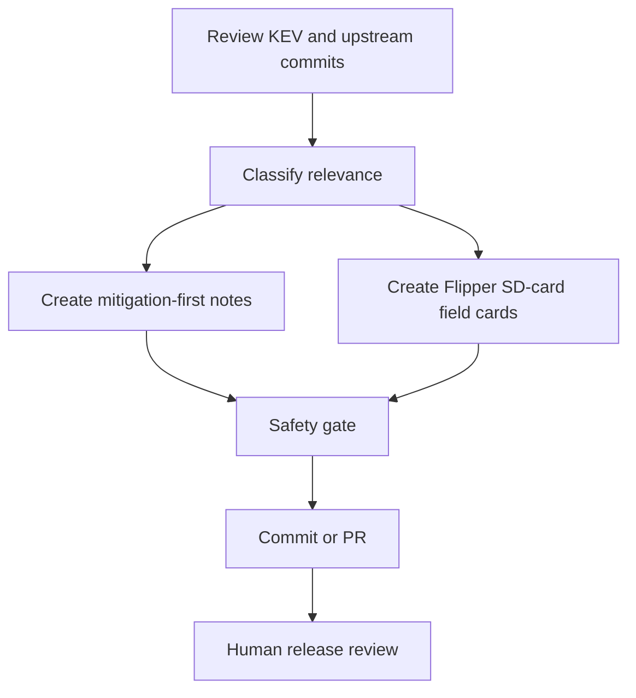

# CyberFlipper Daily Research Update — 2026-06-19

Scope: authorized security research, defensive review, Flipper Zero SD-card content, and lab-safe demonstrations only.

## Summary

This update expands CyberFlipper into a daily field-research pack for the Flipper Zero SD card. It adds daily source-watch notes, CISA KEV mitigation-first triage templates, upstream compatibility notes for UberGuidoZ/Flipper and DarkFlippers/unleashed-firmware, device-readable operator field cards, lab-safe BadUSB scripts, protocol review notes, and visual assets.

No exploit chains, credential harvesting, persistence, evasion, destructive behavior, rolling-code replay, access-control cloning, or unauthorized targeting content is included.

## Source Watch

| Source | CyberFlipper use | Daily action |
|---|---|---|
| CISA KEV | Prioritize defensive research topics | Convert entries into mitigation-first field cards |
| UberGuidoZ/Flipper main | SD-card organization patterns and community content tracking | Review changed folders; do not copy code without license review |
| DarkFlippers/unleashed-firmware dev | Compatibility and UX tracking | Document compatibility notes; do not flash firmware from this pack |
| Official Flipper docs | File-format sanity checks | Keep examples aligned to SD-card paths |

## SD Card Layout

Copy these folders to the Flipper SD card root through qFlipper:

```text
badusb/CyberFlipper_Lab/
infrared/CyberFlipper_Notes/
nfc/CyberFlipper_Notes/
subghz/CyberFlipper_Notes/
lfrfid/CyberFlipper_Notes/
apps_data/cyberflipper/
assets/cyberflipper/
docs/daily/
```

## Daily Workflow



## Safety Rules

1. Written authorization first.
2. No live exploit steps.
3. No credential collection.
4. No persistence or stealth.
5. No destructive commands.
6. No real NFC, RFID, or Sub-GHz secrets.
7. No unauthorized transmission.
8. Report risk and mitigation.

## Device-Facing Daily Output

The device-facing files are plain `.txt`, BadUSB `.txt`, or text-based display assets. The BadUSB scripts only type local checklists or banners for operator documentation.
